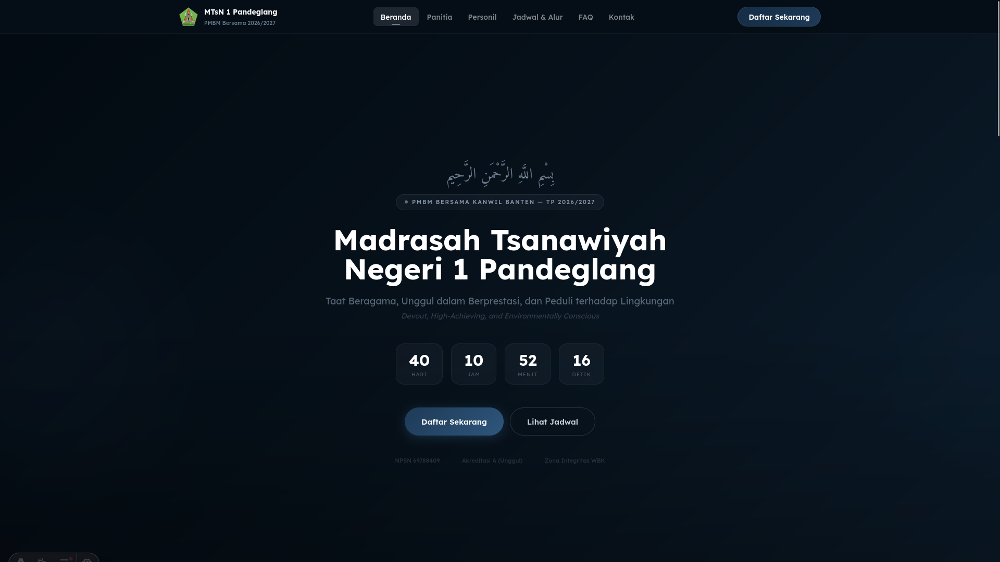
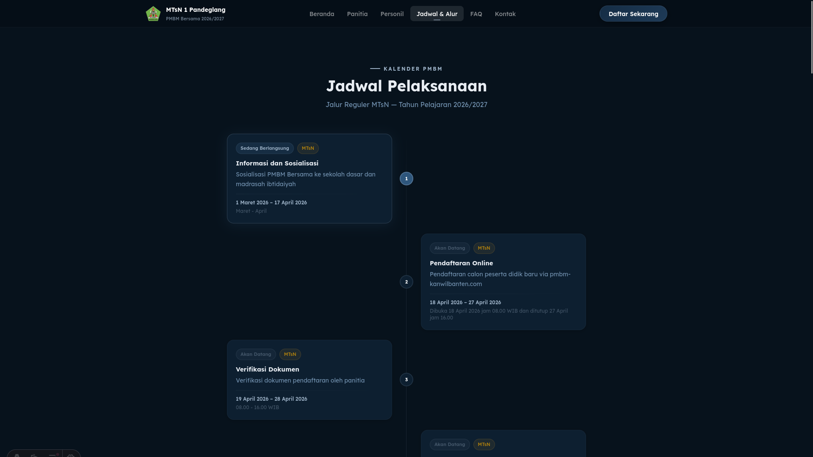
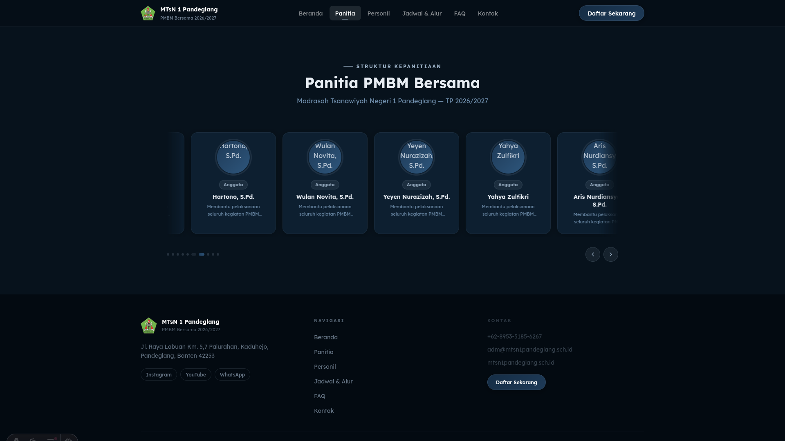
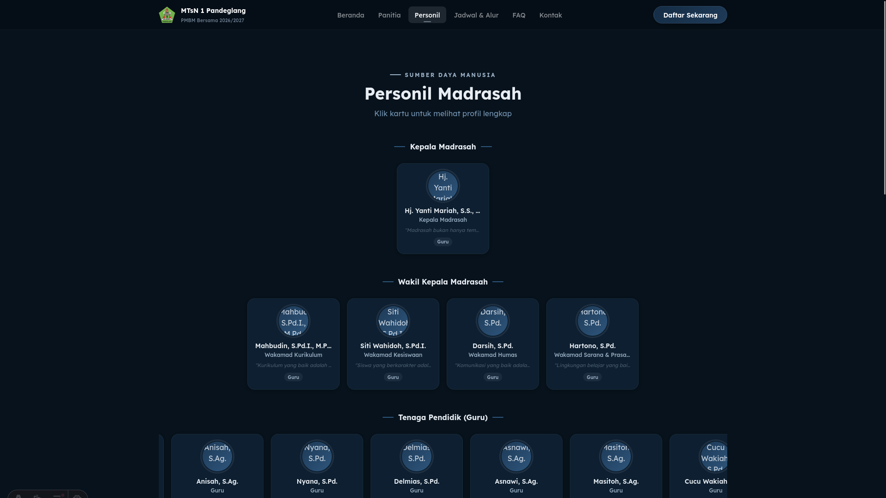
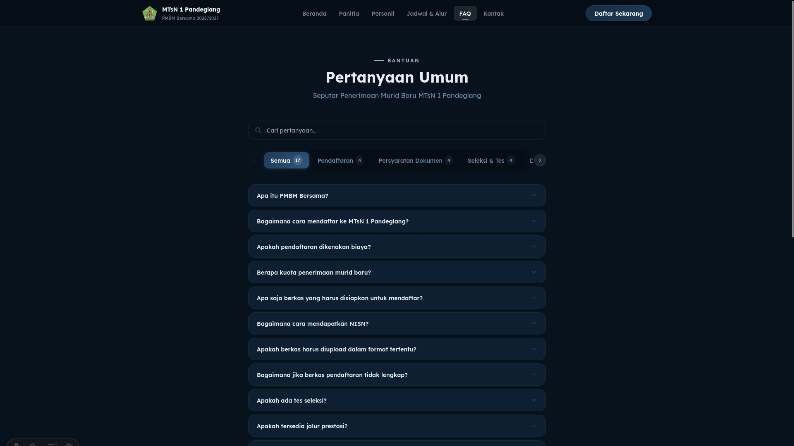
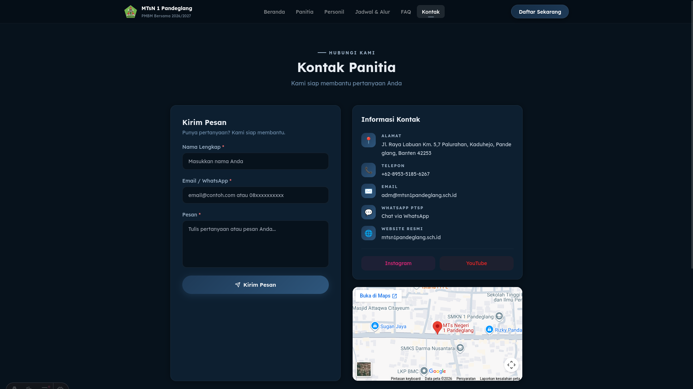

# PMBM MTsN 1 Pandeglang

Website resmi Penerimaan Murid Baru Madrasah (PMBM) Bersama **Madrasah Tsanawiyah Negeri 1 Pandeglang** Tahun Pelajaran 2026/2027.

---

## Screenshot

| Halaman | Preview |
|---|---|
| Beranda |  |
| Jadwal & Alur |  |
| Panitia |  |
| Personil |  |
| FAQ |  |
| Kontak |  |

---

## Teknologi

- [Astro](https://astro.build) — Static Site Generator
- [React](https://react.dev) — Komponen interaktif
- [Tailwind CSS](https://tailwindcss.com) — Styling
- [GSAP](https://gsap.com) — Animasi
- [Lenis](https://lenis.darkroom.engineering) — Smooth scroll
- [Mermaid](https://mermaid.js.org) — Diagram alur

---

## Instalasi

```bash
# Clone repo
git clone https://github.com/zulfikriyahya/pmbm-mtsn1pandeglang.git
cd pmbm-mtsn1pandeglang

# Install dependencies
npm install

# Jalankan dev server
npm run dev
```

Buka `http://localhost:4321` di browser.

---

## Build & Deploy

### Build

```bash
npm run build
```

Output akan berada di folder `dist/`.

### Generate PWA Icons

```bash
node scripts/gen-icons.mjs
```

Pastikan `public/favicon.png` sudah tersedia sebelum menjalankan script ini.

### Deploy ke Nginx

```bash
# Copy dist ke server
scp -r dist/ user@server:/var/www/daftar/

# Copy config nginx
sudo cp nginx/daftar.mtsn1pandeglang.sch.id /etc/nginx/sites-available/
sudo ln -s /etc/nginx/sites-available/daftar.mtsn1pandeglang.sch.id /etc/nginx/sites-enabled/

# Test & reload
sudo nginx -t
sudo systemctl reload nginx
```

---

## Struktur Folder

```
pmbm-mtsn1-pandeglang/
├── public/
│   ├── assets/
│   │   ├── og/          # Open Graph image
│   │   ├── pattern/     # Pattern dekoratif (islamic.svg)
│   │   └── personil/    # Foto personil & panitia (.png)
│   ├── icons/           # PWA icons (auto-generated)
│   ├── favicon.png
│   ├── manifest.webmanifest
│   ├── robots.txt
│   └── sw.js
├── scripts/
│   └── gen-icons.mjs    # Script generate PWA icons
├── src/
│   ├── components/
│   │   ├── faq/
│   │   ├── global/
│   │   ├── home/
│   │   ├── jadwal/
│   │   ├── kontak/
│   │   ├── panitia/
│   │   └── personil/
│   ├── config/
│   │   └── site.ts      # Konfigurasi utama site
│   ├── data/
│   │   ├── faq.json
│   │   ├── jadwal.json
│   │   ├── panitia.json
│   │   └── personil.json
│   ├── layouts/
│   │   └── BaseLayout.astro
│   ├── pages/
│   │   ├── index.astro
│   │   ├── panitia.astro
│   │   ├── personil.astro
│   │   ├── jadwal.astro
│   │   ├── faq.astro
│   │   ├── kontak.astro
│   │   └── 404.astro
│   └── styles/
│       └── global.css
├── astro.config.mjs
├── tailwind.config.mjs
├── tsconfig.json
└── package.json
```

---

## Konfigurasi

Semua konfigurasi utama ada di `src/config/site.ts`:

```ts
export const SITE = {
  name: "Madrasah Tsanawiyah Negeri 1 Pandeglang",
  url: "https://daftar.mtsn1pandeglang.sch.id",
  registrationUrl: "https://pmbm-kanwilbanten.com/",
  tahunPelajaran: "2026/2027",
  registrationDeadline: "2026-04-27T16:00:00",
  // ...
};
```

---

## Lisensi

**MIT** — Bebas digunakan, dimodifikasi, dan didistribusikan dengan tetap mencantumkan atribusi kepada MTsN 1 Pandeglang. Lihat file LICENSE untuk detail lengkap.

---

<p align="center">
  Dikelola oleh <a href="https://github.com/zulfikriyahya">Tim PUSDATIN</a> · MTsN 1 Pandeglang
</p>
